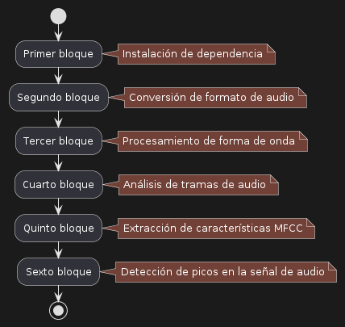
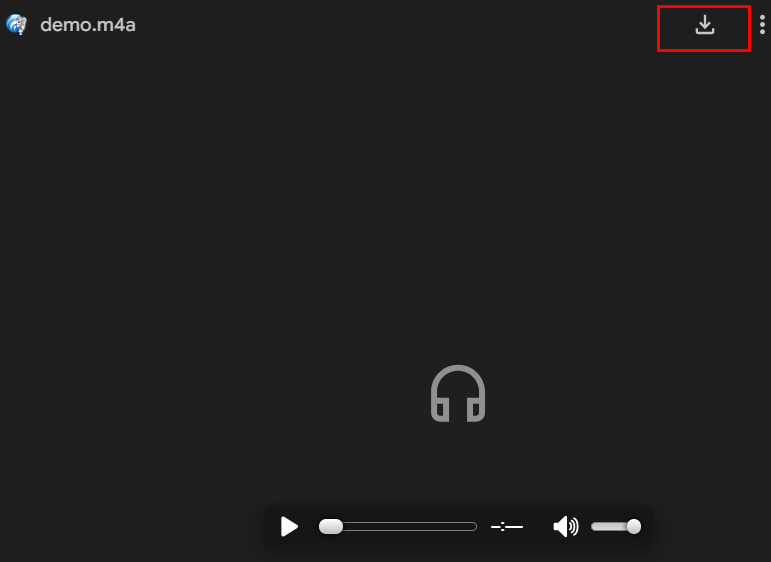
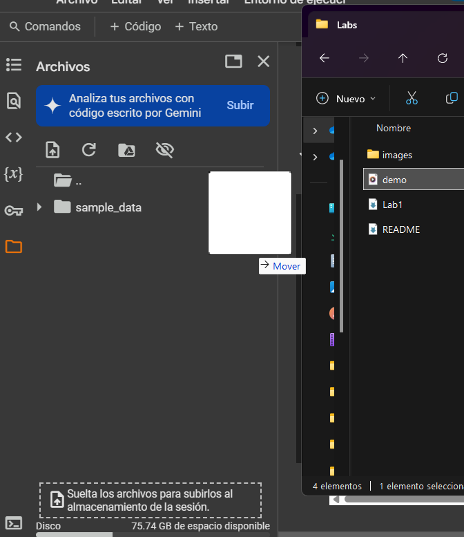
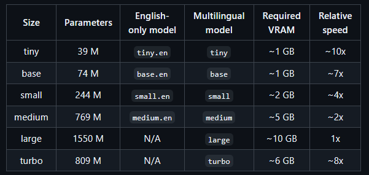
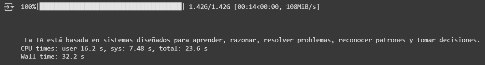

# Práctica 1. Comparación generacional en reconocimiento de voz

## Objetivo de la práctica:

Al finalizar la práctica, serás capaz de:
- Identificar la diferencia, tanto en código, variabilidad y eficiencia, entre los algoritmos que se usaban para el reconocimiento de voz antes de implementar IA, comparada con Whisper, una de las inteligencias artificiales de reconocimiento de voz más eficiente en la actualidad.

## Objetivo visual:



## Duración aproximada:
- 40 minutos.

## Instrucciones:

### Configuración del entorno de trabajo:

1. Dentro de Google Drive, selecciona `Nuevo`.


2. Da clic en `Más` y después en `Conectar con más aplicaciones`.


3. En el buscador, escribe `Colab` y selecciona el que dice `Colaboratory`.


4. Da clic en `Instalar`.


5. En el botón de`Nuevo`, selecciona `Colaboratory`.


6. Cuando se abra un nuevo archivo, selecciona `Entorno de ejecución`.


7. Selecciona `Cambiar tipo de entorno de ejecución`.


8. Selecciona `T4 GPU` y da clic en `Guardar`.


9. Finalmente, conéctate a los recursos seleccionados.


### Tarea 1. Reconocimiento de voz sin usar Inteligencia Artificial 📠.

Paso 1. Escribe el siguiente comando en una celda para instalar las librerías necesarias:

```python
pip install pydub
```

Paso 2. Da clic en el botón de ejecucion:

 

Paso 3. Ingresa al siguiente enlace y descarga el archivo [`demo.wav`](https://drive.google.com/file/d/1mcn3E2UimZOLioW0sLNhbNc_q_9KUihv/view?usp=sharing)

 

Paso 4. Arrastra el archivo descargado `demo.wav` a la carpeta de archivos del entorno de trabajo.



Paso 5. Coloca el siguiente código en una nueva celda y ejecútalo. El resultado debe ser: `La conversión a WAV se ha completado y el archivo se encuentra en: /content/converted_audio.wav`

```python
from pydub import AudioSegment
import os

m4a_file_path = "/content/demo.m4a"

audio = AudioSegment.from_file(m4a_file_path, format="m4a")

wav_file_path = "/content/converted_audio.wav"

audio.export(wav_file_path, format="wav")

if os.path.exists(wav_file_path):
    print("La conversión a WAV se ha completado y el archivo se encuentra en:", wav_file_path)
else:
    print("La conversión a WAV ha fallado.")
```

Paso 6. Ejecuta el siguiente bloque de código en una nueva celda para observar la forma de la señal.

```python
import wave
import matplotlib.pyplot as plt
import numpy as np

audio_file = wave.open("/content/converted_audio.wav", "rb")

audio_data = audio_file.readframes(-1)
audio_data = np.frombuffer(audio_data, dtype=np.int16)

plt.figure(figsize=(12, 4))
plt.plot(audio_data)
plt.title("Forma de onda de la señal de audio")
plt.xlabel("Muestras")
plt.ylabel("Amplitud")
plt.show()
```

Paso 7. Ejecuta el siguiente código para ver las predicciones que realiza este sistema previo al uso de la inteligencia artificial.

```python
import wave
import numpy as np
import matplotlib.pyplot as plt
from scipy.signal import find_peaks
from scipy.fftpack import fft

def analyze_frequency(segment, sample_rate):
    # Transformada de Fourier para obtener frecuencias dominantes
    N = len(segment)
    freqs = np.fft.fftfreq(N, 1/sample_rate)
    fft_values = np.abs(fft(segment))
    
    dominant_freq = freqs[np.argmax(fft_values[:N//2])]  
    return dominant_freq

def simple_phoneme_recognition(frequency):
    # Tabla aproximada de frecuencias de fonemas en Hz
    phoneme_map = {
        "a": (700, 1200),
        "e": (400, 1000),
        "i": (300, 900),
        "o": (500, 900),
        "u": (250, 700)
    }
    for phoneme, (low, high) in phoneme_map.items():
        if low <= frequency <= high:
            return phoneme
    return "?" 


audio_file = wave.open("/content/converted_audio.wav", "rb")
sample_rate = audio_file.getframerate()
audio_data = audio_file.readframes(-1)
audio_data = np.frombuffer(audio_data, dtype=np.int16)

# Graficar la forma de onda
plt.figure(figsize=(12, 4))
plt.plot(audio_data)
plt.title("Forma de onda de la señal de audio")
plt.xlabel("Muestras")
plt.ylabel("Amplitud")
plt.show()

# Detección de picos (posibles inicios de fonemas)
peaks, _ = find_peaks(audio_data, height=1000, distance=500)
plt.figure(figsize=(12, 4))
plt.plot(audio_data)
plt.plot(peaks, audio_data[peaks], "x", color="red")
plt.title("Picos detectados en la señal de audio")
plt.xlabel("Muestras")
plt.ylabel("Amplitud")
plt.show()

# Análisis de frecuencia por segmentos y transcripción aproximada
transcription = ""
window_size = 1024  
for peak in peaks:
    start = max(0, peak - window_size // 2)
    end = min(len(audio_data), peak + window_size // 2)
    segment = audio_data[start:end]
    freq = analyze_frequency(segment, sample_rate)
    transcription += simple_phoneme_recognition(freq) + " "

print("Transcripción aproximada:", transcription)
```

### Tarea 2. Reconocimiento de voz usando librerías de Inteligencia Artificial 📠.

Paso 8. Ejecuta el siguiente comando en una nueva celda de código:

```python
!pip install SpeechRecognition pydub
```

Paso 9. Ejecuta el siguiente código en una nueva colinealidad, la salida deber ser la siguiente: `La IA está basada en sistemas diseñados para aprender, razonar, resolver problemas, reconocer patrones y tomar decisiones`.

```python
import speech_recognition as sr
from pydub import AudioSegment

# Convertir el archivo a formato compatible si es necesario
audio_path = "/content/converted_audio.wav"

# Inicializar el reconocedor
recognizer = sr.Recognizer()

# Cargar el archivo de audio
with sr.AudioFile(audio_path) as source:
    audio_data = recognizer.record(source)

# Reconocer el texto en el audio
try:
    text = recognizer.recognize_google(audio_data, language='es-ES')
    print("Texto reconocido: \n" + text)
except sr.UnknownValueError:
    print("Google Speech Recognition no pudo entender el audio")
except sr.RequestError as e:
    print(f"Error al solicitar resultados de Google Speech Recognition; {e}")
```


### Tarea 3. Transcripción de voz a texto usando Whisper.

Paso 10. Ingresa al siguiente enlace y baja hasta encontrar los modelos disponibles: https://github.com/openai/whisper

 

Paso 11. Ejecuta el siguiente comando en una nueva celda de código:

```python
pip install git+https://github.com/openai/whisper.git
```

Paso 12. Ejecuta el siguiente código en una nueva celda probando el modelo `tiny` de Whisper.

```python
%%time

import whisper

model = whisper.load_model("tiny")
result = model.transcribe("/content/demo.m4a")
print("\n\n")
print(result["text"])

#La IA está basada en sistemas diseñados para aprender, razonar, resolver problemas, reconocer patrones y tomar decisiones.
```

Paso 13. Ahora, en la línea de código `model = whisper.load_model("tiny")`, cambia `base` por `medium` por `small` y evalúa el nuevo rendimiento.

```python
%%time

import whisper

model = whisper.load_model("base")
result = model.transcribe("/content/demo.m4a")
print("\n\n")
print(result["text"])
```

Paso 14. Repítelo ahora para probar el modelo `small` y `medium`.

### Resultado esperado:

 
