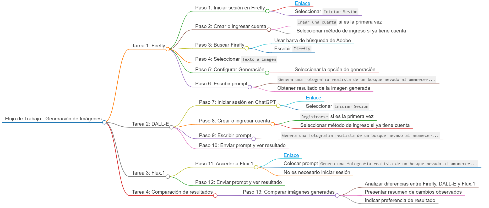
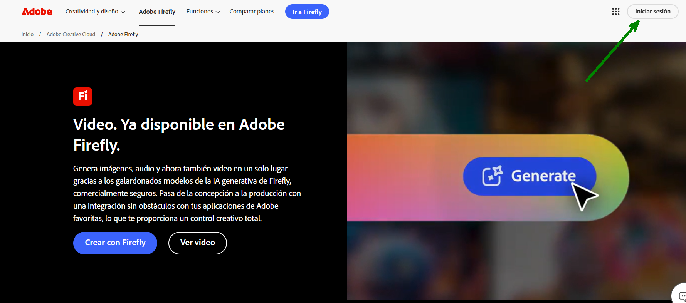
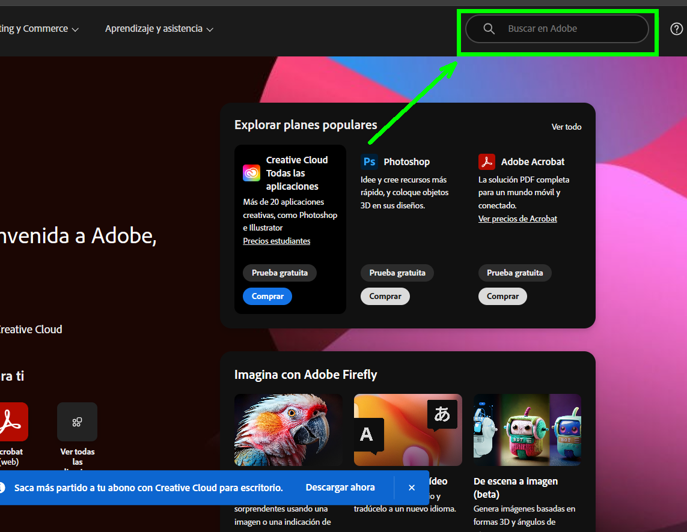
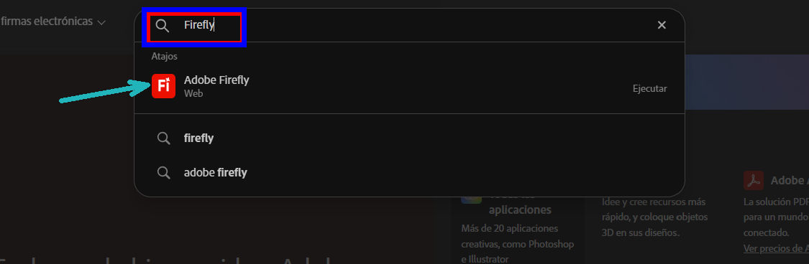
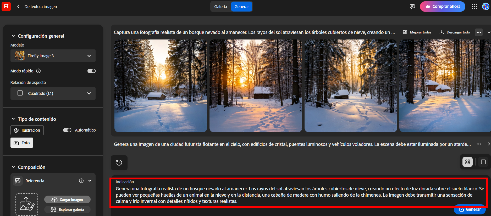
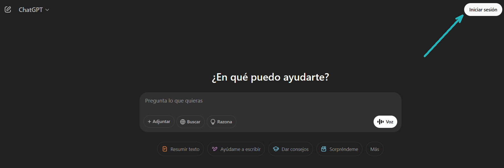
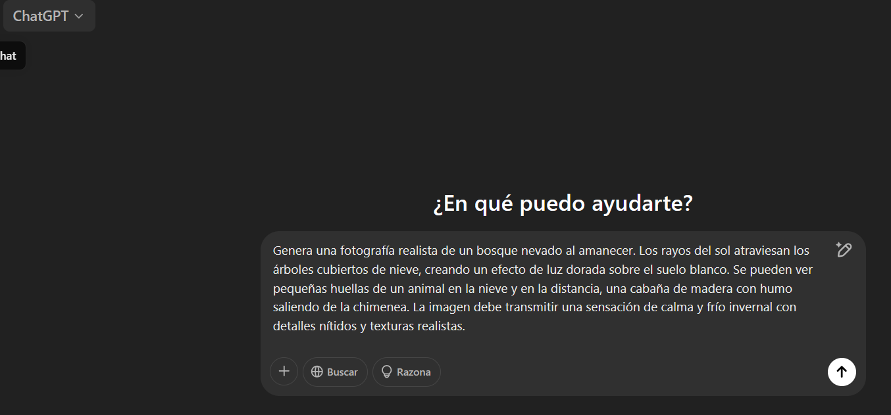
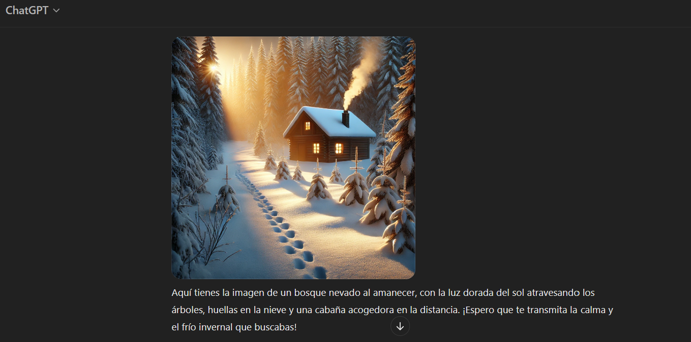
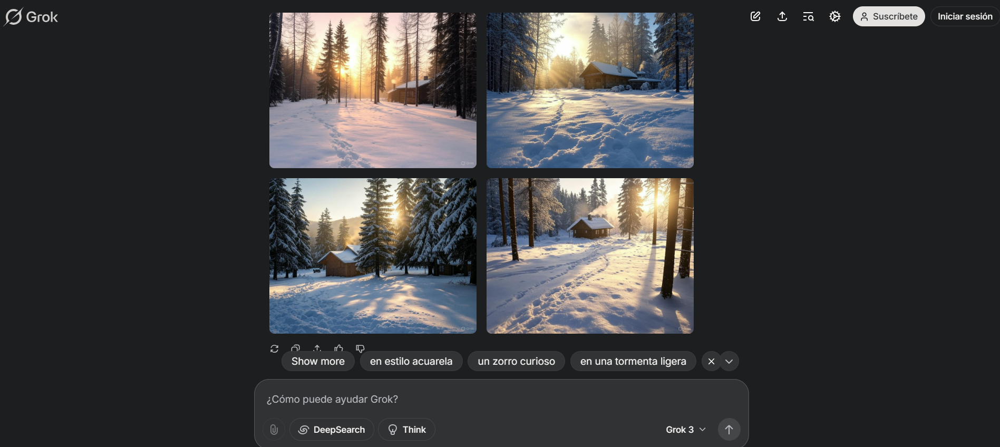

# Práctica 4. Aplicaciones prácticas de la Inteligencia Artificial

## Objetivo de la práctica:

Al finalizar la práctica, serás capaz de:

- Observar la influencia de la Inteligencia Artificial en aplicaciones como la generación de imágenes a partir de comandos de texto (prompts), y analizar cómo los distintos modelos utilizados pueden producir resultados diferenciables entre sí.

## Objetivo visual:

 

## Duración aproximada:

- 40 minutos.

---

**[⬅️ Atrás](https://netec-mx.github.io/IA-ML/Cap%C3%ADtulo3/Lab3.html)** | **[Lista General](https://netec-mx.github.io/IA-ML/)** | **[Siguiente ➡️](https://netec-mx.github.io/IA-ML/Cap%C3%ADtulo5/Lab5.html)**

---

## Instrucciones:

### Tarea 1. Firefly.

Paso 1. Dirígete al siguiente [enlace](https://www.adobe.com/pe/products/firefly.html) y selecciona `Iniciar sesión`.

 

Paso 2. Si es la primera vez que ingresas, selecciona `Crear una cuenta`. Si ya cuentas con una, selecciona alguna de las formas de ingreso disponibles.

 

Paso 3. Una vez dentro, selecciona `Buscar en Adobe` y escribe `Firefly`.

 
 

Paso 4. Dentro de Firefly, elige la opción de usar el servicio `De texto a imagen`.

 

Paso 5. Seleccionar la opción de Generacion

 

Paso 6. En la barra de texto, escribe el siguiente prompt: `Genera una fotografía realista de un bosque nevado al amanecer. Los rayos del sol atraviesan los árboles cubiertos de nieve, creando un efecto de luz dorada sobre el suelo blanco. Se pueden ver pequeñas huellas de un animal en la nieve y en la distancia, una cabaña de madera con humo saliendo de la chimenea. La imagen debe transmitir una sensación de calma y frío invernal con detalles nítidos y texturas realistas`. 

Con ello se obtiene, el resultado de la tarea 1.

 

### Tarea 2. DALL-E.

Paso 7. Ingresa al siguiente [enlace](https://chatgpt.com/) y selecciona `Iniciar sesión`.

 

Paso 8. Si es la primera vez que ingresas, selecciona `Registrarse`. Si ya cuentas con una, selecciona alguna de las formas de ingreso disponibles.

 

Paso 9. Una vez dentro, en la barra de texto escribe el siguiente prompt: `Genera una fotografía realista de un bosque nevado al amanecer. Los rayos del sol atraviesan los árboles cubiertos de nieve, creando un efecto de luz dorada sobre el suelo blanco. Se pueden ver pequeñas huellas de un animal en la nieve y en la distancia, una cabaña de madera con humo saliendo de la chimenea. La imagen debe transmitir una sensación de calma y frío invernal con detalles nítidos y texturas realistas.`

 

Paso 10. Envia el prompt y observa el resultado.

 

### Tarea 3. Flux.1.

Paso 10. Dirígete al siguiente [enlace](https://grok.com/) y coloca el prompt: `Genera una fotografía realista de un bosque nevado al amanecer. Los rayos del sol atraviesan los árboles cubiertos de nieve, creando un efecto de luz dorada sobre el suelo blanco. Se pueden ver pequeñas huellas de un animal en la nieve y en la distancia, una cabaña de madera con humo saliendo de la chimenea. La imagen debe transmitir una sensación de calma y frío invernal con detalles nítidos y texturas realistas`. 

**Nota:** No es estrictamente necesario iniciar sesión.

 

Paso 11. Envia el prompt y revisa el resultado.

 

### Tarea 4. Comparación de resultados.

Paso 12. Compara los resultados de las tres tareas realizadas, analiza las diferencias entre ellas y presenta un resumen de los cambios observados indicando cuál de ellos es de tu preferencia.

### Resultado esperado:

 

 

 
