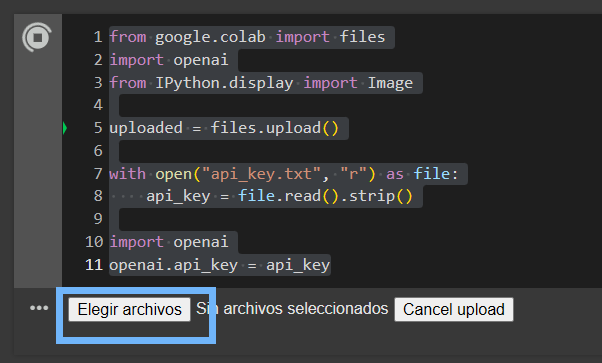

# Práctica 5. API GPT: DALL-E 3

## Objetivo de la práctica:

Al finalizar la práctica, serás capaz de:

- Aprender a utilizar la API de GPT para realizar llamadas al modelo de generación de imágenes DALL-E 3.

## Objetivo visual:

 

## Duración aproximada:

- 45 minutos.

## Instrucciones:

### Configuración del entorno de trabajo:

1. Dentro de Google Drive, selecciona `Nuevo`.


2. Da clic en `Más` y después en `Conectar con más aplicaciones`.


3. En el buscador, escribe `Colab` y selecciona el que dice `Colaboratory`.


4. Da clic en `Instalar`.


5. En el botón de`Nuevo`, selecciona `Colaboratory`.


6. Cuando se abra un nuevo archivo, selecciona `Entorno de ejecución`.


7. Selecciona `Cambiar tipo de entorno de ejecución`.


8. Selecciona `T4 GPU` y da clic en `Guardar`.


9. Finalmente, conéctate a los recursos seleccionados.


### Tarea 1. Crear imagenes con DALL-E 3.

Paso 1. Ejecuta el siguiente comando para usar Dall-E 3.

```python
!pip install openai==0.28
```

Paso 2. Dirígete al siguiente [enlace](https://platform.openai.com/api-keys); ahí deberás autenticarte para crear una API-Key.

Paso 3. Una vez dentro, ve a la sección de `API Keys` y crea una nueva API-Key dando clic en `Create new secret key`.


Paso 4. Coloca un nombre para la API y da clic en `Create secret key`.


Paso 5. Copia el valor de la API-Key y pégalo en un bloc de notas al que puedan acceder facilmente.


Paso 6. Ejecuta el siguiente código en Colab y da clic en `Elegir archivos` para cargar el bloc de notas donde se encuentra la API-Key.

```python
from google.colab import files
import openai
from IPython.display import Image

uploaded = files.upload()

with open("api_key.txt", "r") as file:
    api_key = file.read().strip()

import openai
openai.api_key = api_key
```




Paso 7. Ejecuta el siguiente código, donde en la variable llamada `prompt` escribirá el texto que se le pide a DALL-E 3 para generar la imagen.

```python
response = openai.Image.create(
  model="dall-e-3",
  prompt="Un gato tocando el piano al atardecer",
  n=1,
  size="1024x1024"
)
image_url = response.data[0].url
```

Paso 8. Finalmente, ejecuta el siguiente código para visualizar la imagen creada.

```python
from IPython.display import Image

Image(url=image_url)
```

### Tarea 2. Editar una imagen.

Paso 9. Ingresa al siguiente [enlace](https://drive.google.com/file/d/1IWtCHoxJgBAfFzFOchZT4aYSKB4UQd8O/view?usp=sharing) y descarga la imagen.


Paso 10. Dirígete al siguiente [enlace](https://platform.openai.com/docs/guides/images?api-mode=chat) y baja hasta la sección de requerimientos de la imagen de entrada.


Paso 11. Ingresa al siguiente [enlace](https://www.photopea.com/) y arrastra en la seecion de `Suelta cualquier archivo aquí` la imagen que se descargó previamente. 

Paso 12. Selecciona la opción de borrador.


Paso 13. Inicia con el borrado de la carretera usando el mouse.


Paso 14. Dirígete a `Archivo`, luego a `Exportar` y exporta la imagen en formato `png`.


Paso 15. Asígnale un nombre y selecciona `Guardar`.


Paso 16. Carga esa imagen descargada a Colab y colocar el siguiente código:

```python
response = openai.Image.create_edit(
  image=open("/content/carretera.png", "rb"),
  mask=open("/content/carretera_mask.png", "rb"),
  prompt="ferrocarril en un paisaje",
  n=1,
  size="512x512"
)
image_url = response['data'][0]['url']
```

Paso 17. Para la nueva imagen cargada, da clic derecho y selecciona `Copiar ruta`.


Paso 18. Dicha ruta, colócala en la línea de código de la varible `mask`.

```python
mask=open("/content/carretera_mask.png", "rb"),
```


Paso 19. Finalmente, ejecuta la celda de código para visualizar la imagen editada.

### Resultado esperado:


