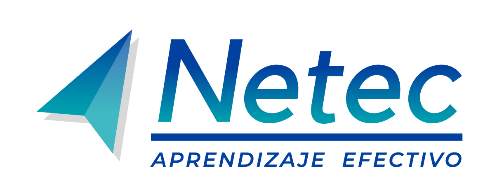

#  

**Plataforma de Laboratorios**

Bienvenido a la **Plataforma de Laboratorios** del curso **Inteligencia Artificial y el Aprendizaje Automático**. Aquí podrás explorar diferentes tecnologías a través de prácticas guiadas. ¡Desarrolla tus habilidades y lleva tus conocimientos al siguiente nivel!

---

## 🌟 **Lista de Laboratorios**

Cada uno de estos laboratorios está diseñado para ofrecerte una experiencia práctica. Haz clic en los enlaces para comenzar.

01. **[Práctica 1. Comparación generacional en reconocimiento de voz](./Capítulo1/Lab1.md)**
   - ⏱️ **Duración estimada**: 40 minutos

02. **[Práctica 2. Primera red neuronal](./Capítulo2/lab2.md)**
   - ⏱️ **Duración estimada**: 60 minutos

03. **[Práctica 3. Aplicación real de una Red Neuronal](.//Capítulo3/lab3.md)**
   - ⏱️ **Duración estimada**: 60 minutos

04. **[Práctica 4. Aplicaciones prácticas de la Inteligencia Artificial](./Capítulo4/lab4.md)**
   - ⏱️ **Duración estimada**: 40 minutos

05. **[Práctica 5. API GPT: DALL-E 3](./Capítulo5/lab5.md)**
   - ⏱️ **Duración estimada**: 45 minutos

06. **[Demostración: IA en Programación: GitHub Copilot](./Capítulo6/lab6.md)**
   - ⏱️ **Duración estimada**: 45 minutos
---

## 📬 **Contacto y más información**
